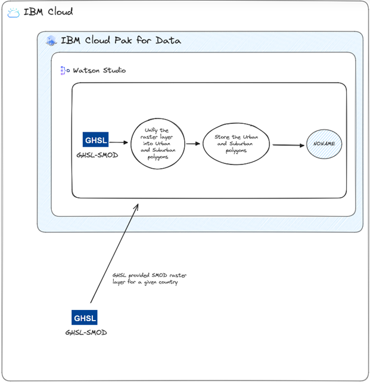
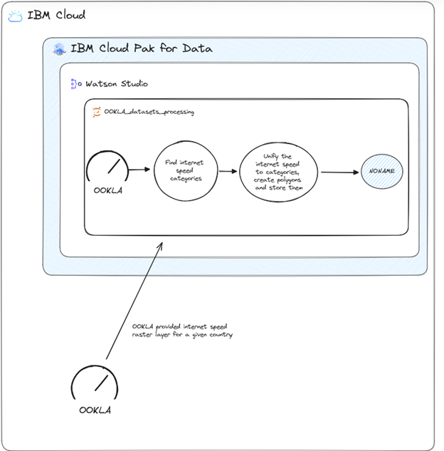
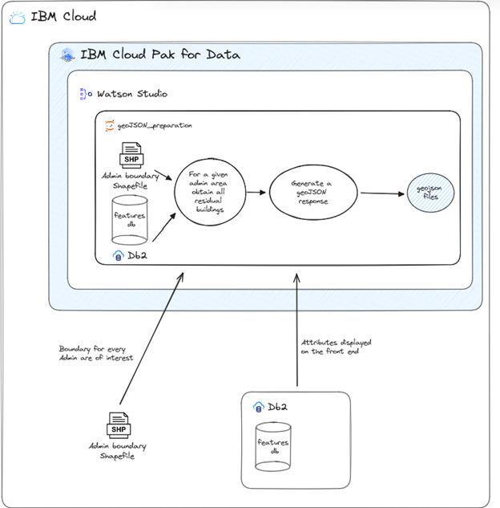
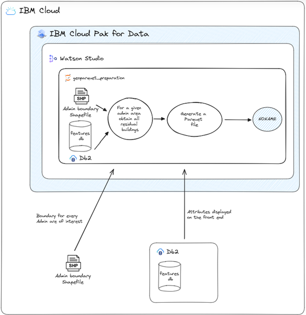

# Front-end Data Preparation

## Objectives

Certain actions requested by end users are supported by complex – and long running – database queries or computations, which – when executed during end-user requests – would cause delays in response time and decrease user experience.

To account for these delays and to improve user experience certain data sets are pre-prepared for immediate consumption to decrease response times. Example of such pre-created data sets in a geoJSON format to avoid database querying when selecting a county or district on the map page.

Additional example of pre-created data is a pre-created overlays, which are not computed, but simply loaded upon request.

## Urban/Suburban Overlay

To create the overlay for urban and suburban areas the raster layer provided by GHSL-SMOD is filtered only to the relevant raster tiles, rural raster tiles are ignored. Than neighbouring raster tiles of the same category are joined together to create polygons as the front-end can more efficiently visualize lower number of larger polygons.

<figure>
  
  <figcaption>Figure 1: Creating the Urban and Suburban overlay</figcaption>
</figure>  

This computation is not actually executed separately as the GHSL-SMOD ingestion process during Data Pre-processing creates the polygons required as a side-effect. Figure 27 provides a logical overview of this computation in a vacuum.

## Internet Speed Overlay

To create an internet speed overlay an OOKLA provided data set is sourced from https://github.com/teamookla/ookla-open-data. Internet speed is provided in this data set as a raster layer of 610x610 meter large tiles, which are categorized into several pre-defined categories based on internet speed ranges. These ranges are defined uniquely for each country as internet speed ranges differ substantially all over the globe. As an example, the following internet speed ranges are used to categorize internet speed in the State of Maharashtra, India:
- very_high – speed range: 112.113 -> 
- high – speed range: 72.002 -> 111.951
- normal – speed range: 31.836 -> 71.97
- slow – speed range: 11.771 -> 31.83
- very_slow – speed range: 0.004 -> 11.746

Neighbouring tiles of the same category are joined together to create larger polygons for the front-end to visualize.

<figure>
  
  <figcaption>Figure 2: OOKLA provided data is processed to polygons for each internet speed category, which is later visualized  by the front-end as an overlay</figcaption>
</figure>  

## Create Pre-generated Area/Sub-area geoJSONs

To improve user experience certain data sets are pre-prepared for immediate consumption to decrease response times, such as pre-created data sets in a geoJSON format to avoid database querying when selecting a county or district on the map page.

These files contain the exact response of the “Draw an area” map option using the exact boundaries of the administrative area.

<figure>
  
  <figcaption>Figure 3: Using a shapefile definition of the administrative area boundary a geoJSON result is generated</figcaption>
</figure> 

This workflow starts with the administrative unit boundary as a shapefile and can be applied to Country/District or Subcounty/Subdistrict levels.

## Creating geoParquet File for Data Scientists

Data Scientists might be interested in the raw version of data sets, which we provide as export from the database for the entire country or its first-level administrative boundaries (e.g., counties or districts) in a Parquet format. In this case all columns of the table are exported in a raw format of the column.

<figure>
  
  <figcaption>Figure 4: Creating an export of raw data into Parquet files based on administrative boundaries</figcaption>
</figure> 

## Implementation Details

The list of most important libraries is provided:
| Package Name | Version | Short Description |
| --- | --- | --- |
| getpass | 1.0.2 | Portable password input |
| jaydebeapi | 1.2.3 | Use JDBC database drivers from Python 2/3 or Jython with a DB-API. |
| jpype | 1.4.1 | A Python to Java bridge. |
| json | default | A library to work with JSON documents. |
| geopandas | 1.0.1 | Geographic pandas extensions |
| pandas | 1.5.3 | Powerful data structures for data analysis, time series, and statistics |
| pyproj | 3.6.1 | Python interface to PROJ (cartographic projections and coordinate transformations library) |
| shapely | 2.0.5 | Manipulation and analysis of geometric objects |
| numpy | 1.23.5 | Fundamental package for array computing in Python |
| requests | 2.31.0 | Python HTTP for Humans. |
| ibm_boto3 |  | The IBM SDK for Python |
| botocore | 1.27.59 | Low-level, data-driven core of boto 3. |
| ibm_cloud_sdk_core | 3.20.3 | Core library used by SDKs for IBM Cloud Services |
| threading | default | Standard threading module |
| scipy | 1.14.0 | Fundamental algorithms for scientific computing in Python |
| rasterio | 1.3.10 | Fast and direct raster I/O for use with Numpy and SciPy |

## Execution Details

To execute the data curation process the following notebooks are executed in any order:
1.	geoJSON_preparation.ipynb
2.	geojson_subdistricts_map.json and geoJSON_preparation_subdistricts.ipynb
3.	geoparquet_preparation.ipynb
4.	OOKLA_datasets_processing.ipynb
